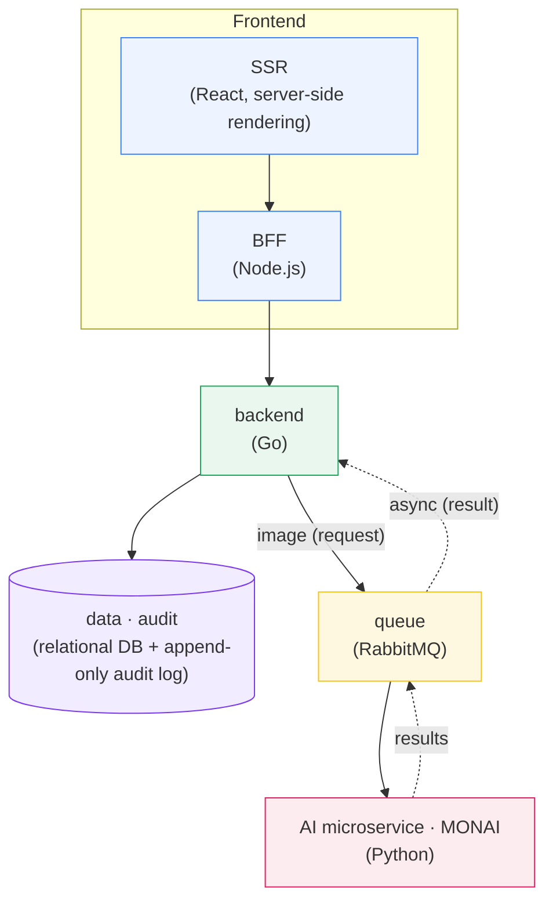
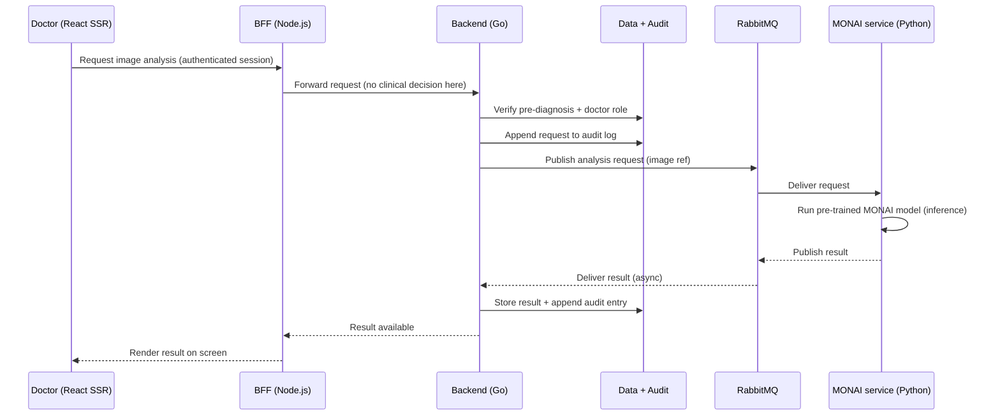

# SINAPSIS · Global Architecture

> **SINAPSIS** — *Sistema Inteligente de Análisis de Patrones de Salud Integrados*.
> A clinical platform that assists doctors by running **pre-trained MONAI models** over
> medical images, while keeping clinical decisions, auditing, and access control in a
> strong backend.

This document describes the end-to-end system architecture: the responsibilities of
each service, the technologies chosen and **why**, and how the AI (MONAI) microservice
fits into the clinical workflow.

---

## 1. High-level overview

The architecture is **polyglot on purpose**: every layer uses the technology best suited
to its job, and the layers are decoupled so that slow or heavy work (AI image analysis)
can never block or break the clinical system.



**Reading the diagram**

- The **Frontend** box contains two pieces that ship together: the **SSR** React app and
  a thin **BFF** that sits right behind it.
- The **backend** (Go) is the single authority for clinical business rules and data.
- **data · audit** is the persistence layer: a relational database for clinical records
  plus an **append-only audit log**.
- The **queue** (RabbitMQ) connects the backend to the **AI microservice** in an
  **asynchronous** way: the backend publishes an image analysis *request*, and later
  receives the *result* — it never waits synchronously for MONAI.

---

## 2. Components and responsibilities

### 2.1 Frontend — React with Server-Side Rendering (SSR)

- A **React** application rendered on the server (SSR) for fast first paint, SEO-friendly
  clinical dashboards, and consistent rendering across devices.
- In this repository the frontend is a **Next.js** app (`../frontend`), React 19, using
  Tailwind CSS. Next.js provides the SSR runtime.
- Responsibility: **presentation only**. It knows nothing about clinical rules; it renders
  what the BFF prepares for it.

### 2.2 BFF — Node.js (Backend For Frontend)

A small **Node.js** service that lives *close to the user* and handles concerns that are
natural on the edge / session layer:

- **MFA** (multi-factor authentication) flows.
- **Session** management (cookies/tokens, refresh, logout).
- **Screen shaping**: aggregating and reshaping backend responses into exactly what a
  given screen needs, so the React app stays simple.

Design principle: **the BFF stays deliberately "dumb" about clinical logic.** It does not
decide who can request a diagnosis or what a valid pre-diagnosis is. Those are clinical
decisions and belong to the backend (see §4).

### 2.3 Backend — Go

The **main backend** is written in **Go**. Rationale:

- Go handles **many concurrent requests with few resources** (goroutines + a lightweight
  runtime), which fits a clinical system with many simultaneous doctors and long-lived
  connections.
- Predictable performance, easy deployment (single static binary), strong standard
  library for networking.

The backend is the **system of record for clinical decisions**. It:

1. Enforces **business rules** (e.g. a required pre-diagnosis must exist before imaging AI
   can run).
2. Enforces **authorization** (e.g. the requesting user must have the doctor role).
3. Writes every meaningful action to the **audit log**.
4. Publishes AI analysis **requests** to the queue and consumes **results** asynchronously.

### 2.4 Data — relational database + append-only audit log

Two distinct stores with different guarantees:

- **Relational database** for **clinical records** (patients, studies, pre-diagnoses,
  results). Relational integrity and constraints protect clinical data consistency.
- **Append-only audit log**: an immutable, insert-only record of *who did what, when, and
  why*. It is never updated or deleted, which is essential for **clinical traceability,
  compliance, and forensic review**. Every AI request and result transition is recorded
  here.

### 2.5 Queue — RabbitMQ

**RabbitMQ** decouples the backend from the AI microservice:

- The backend **publishes** an image-analysis request message.
- The AI microservice **consumes** it, runs the model, and **publishes** the result back.
- Because the exchange is asynchronous, **slow image analysis cannot block or break the
  clinical system**. If MONAI is busy or temporarily down, messages wait in the queue and
  are processed when capacity returns.

### 2.6 AI microservice — Python + MONAI

A **separate Python microservice** (this repository, `microservice/`) that **runs existing
pre-trained MONAI models**. It is a **model runner**, not a model-training project — it
loads published models and executes inference. Detailed in §5.

---

## 3. Technology choices at a glance

| Layer | Technology | Why |
|-------|------------|-----|
| Frontend | React + SSR (Next.js) | Fast first render, SEO-friendly, consistent clinical UI |
| BFF | Node.js | Edge concerns close to the user: MFA, sessions, screen shaping |
| Backend | Go | High concurrency with low resource usage; home of clinical rules |
| Clinical data | Relational database | Integrity & constraints for clinical records |
| Audit | Append-only log | Immutable traceability & compliance |
| Messaging | RabbitMQ | Async decoupling so AI never blocks the clinical path |
| AI | Python + MONAI | Ecosystem for medical imaging; runs pre-trained model bundles |

---

## 4. Why the queue connects to the backend, not the BFF

This is a **deliberate clinical-safety decision**, not just a technical one.

Connecting the AI queue to the **backend** means the backend can **apply business rules
first**. Before any image reaches MONAI, the backend:

1. **Checks the required pre-diagnosis** exists (clinical precondition).
2. **Checks the doctor's role / permissions** (authorization).
3. **Saves the request in the audit log** (traceability).

These are **clinical decisions**, so they must live in the backend — the layer that owns
clinical rules and data — **not** in the BFF, whose job is only sessions, MFA, and
preparing data for the screen.

**Consequences of this choice:**

- The **queue is connected to the backend**, so every AI request passes through the same
  rule + authorization + audit gate.
- The **BFF stays simple**: no clinical logic leaks into the edge layer.
- There is a single, auditable path from "doctor requests analysis" to "MONAI runs it".



---

## 5. The AI microservice (MONAI) in depth

> Scope: this microservice **implements existing models and runs them**. It consumes
> analysis requests from RabbitMQ, executes **pre-trained MONAI models**, and returns
> results. It does not make clinical decisions — those already happened in the backend.

### 5.1 What MONAI is

**MONAI** (*Medical Open Network for AI*) is a **PyTorch-based, open-source framework for
deep learning in healthcare imaging**, part of the PyTorch ecosystem. It provides:

- **Flexible pre-processing** for multi-dimensional medical images (CT, MRI, etc.).
- **Domain-specific implementations**: networks, losses, metrics, and inferers built for
  medical imaging.
- **Composable, portable APIs** that integrate into existing workflows.
- GPU-accelerated transforms and multi-GPU support.

For SINAPSIS the relevant part is **inference with existing models**, delivered through the
**MONAI Bundle** format and the **MONAI Model Zoo**.

### 5.2 MONAI Model Zoo + Bundle format (running existing models)

The **MONAI Model Zoo** hosts a collection of medical-imaging models packaged in the
**MONAI Bundle** format. A bundle is a **self-describing package** of everything needed to
run a model, so this microservice can download and execute a published model without
re-implementing it. A bundle typically contains:

- `models/` — the model weights (`model.pt`) and/or a TorchScript export (`model.ts`).
- `configs/` — declarative configuration: `metadata.json`, `inference.json`
  (pre-processing → network → inference → post-processing), and optionally `train.json`.
- `docs/` — usage notes and license (`data_license.txt` where applicable).

Downloading and running a bundle is as simple as:

```bash
pip install "monai[fire]"

# Download an existing pre-trained model (e.g. spleen CT segmentation)
python -m monai.bundle download "spleen_ct_segmentation" --bundle_dir "bundles/"

# Run inference using the bundle's own config
python -m monai.bundle run \
    --config_file bundles/spleen_ct_segmentation/configs/inference.json
```

Because the bundle carries its own inference pipeline, the microservice's job is to
**select the right bundle for the study type, feed it the image, and return the output**.

> Models are published under their own licenses; the Model Zoo makes **no claim of
> suitability for diagnostic use**. SINAPSIS treats MONAI output as **decision support**,
> with the doctor and backend rules remaining authoritative.

### 5.3 Typical inference pipeline inside a bundle

A MONAI Bundle's `inference.json` chains standard components. Conceptually:

1. **Load & normalize input** — e.g. `LoadImaged`, `EnsureChannelFirstd`, `Orientationd`,
   `Spacingd`, `ScaleIntensityRanged` to bring the image into the model's expected space
   and intensity range.
2. **Network** — the pre-trained architecture (e.g. a UNet/SegResNet) with weights loaded
   from `models/`.
3. **Inferer** — often a `SlidingWindowInferer` for large volumetric scans, so a big 3D
   image is processed in overlapping patches.
4. **Post-processing** — e.g. `Activationsd`, `AsDiscreted`, `Invertd` (map predictions
   back to the original image space), and `SaveImaged` to write the result (mask,
   segmentation, or score).

The same idea can be driven programmatically with `ConfigParser` / `BundleWorkflow` when
the microservice needs finer control over I/O and error handling.

### 5.4 Service responsibilities and message flow

The microservice runs as a **RabbitMQ consumer**:

1. **Consume** an analysis request from the queue. The message references the image and the
   requested analysis type (the backend already validated pre-diagnosis, role, and audit).
2. **Resolve the model**: choose / load the appropriate MONAI bundle for that analysis type
   (cached locally after first download).
3. **Run inference** using the bundle's pipeline (pre-process → network → inferer →
   post-process), on GPU when available.
4. **Publish the result** back to RabbitMQ (segmentation mask, classification, confidence,
   and metadata), or an error message if inference fails.
5. **Ack** the message. Failures can be retried or dead-lettered so a single bad image
   never stalls the pipeline.

Design properties this gives SINAPSIS:

- **Isolation** — heavy PyTorch/GPU work lives in its own process and can scale (more
  consumers) independently of the clinical backend.
- **Resilience** — if the AI service is down, requests **queue up**; the clinical system
  keeps serving doctors.
- **Statelessness** — the microservice holds no clinical state; it reads a request, runs a
  model, returns a result. All state and audit live in the backend/data layer.

### 5.5 Runtime & packaging notes

- **Python + PyTorch + MONAI**; GPU strongly recommended for volumetric inference.
- An official MONAI Docker image exists (`projectmonai/monai`), which is a convenient base
  for containerizing this service alongside a RabbitMQ client.
- Bundles are fetched from the Model Zoo / Hugging Face and cached, so repeated inferences
  do not re-download weights.

---

## 6. End-to-end flow summary

1. A doctor triggers an analysis from the **React SSR** UI.
2. The **BFF (Node.js)** handles session/MFA and forwards the request — **no clinical
   decision** is made here.
3. The **backend (Go)** enforces the **pre-diagnosis** requirement and **doctor role**,
   then **appends** the request to the **audit log**.
4. The backend **publishes** the request to **RabbitMQ**.
5. The **MONAI microservice (Python)** consumes it, runs the **pre-trained model**, and
   **publishes the result** back asynchronously.
6. The backend stores the result, **appends another audit entry**, and the BFF shapes it
   for the screen.
7. The React SSR UI **renders** the result as decision support for the doctor.

This layout keeps clinical authority and auditing centralized in the Go backend, keeps the
BFF simple, and isolates slow AI work behind a queue so it can never block the clinical
system.

---

## 7. References

- MONAI framework: <https://github.com/Project-MONAI/MONAI> · docs: <https://monai.readthedocs.io/>
- MONAI Model Zoo: <https://github.com/Project-MONAI/model-zoo> · browser:
  <https://project-monai.github.io/model-zoo.html>
- MONAI Bundle format: <https://monai.readthedocs.io/en/stable/bundle_intro.html>
- Model hosting: <https://huggingface.co/MONAI>
